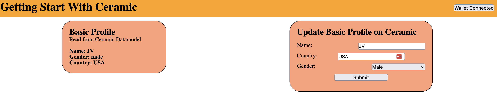

# A simple getting started ceramic app!

## Resources
- [Repo + Guide](https://github.com/ceramicstudio/tutorial-getting-started-with-ceramic)
- [YouTube walk thru](https://www.youtube.com/watch?v=rpyokDPnyUs&ab_channel=CeramicNetwork)

## To run the app

Run the `index.html` file in your browser using [LiveShare](https://visualstudio.microsoft.com/services/live-share/).

